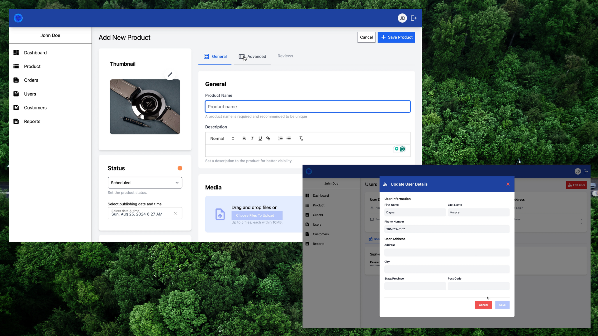

# Demo E-commerce Admin App(Vue.js + Laravel)

## 📌 Introduction
A demo e-commerce admin app built using Vue.js for the frontend and Laravel for the backend.

## 🚀 Features
- Admin Authentication (Login, Register, JWT-based authentication)
- Product Management (List, View, Search, and Filter)
- RESTful API with Laravel
- Responsive UI using TailwindCSS

